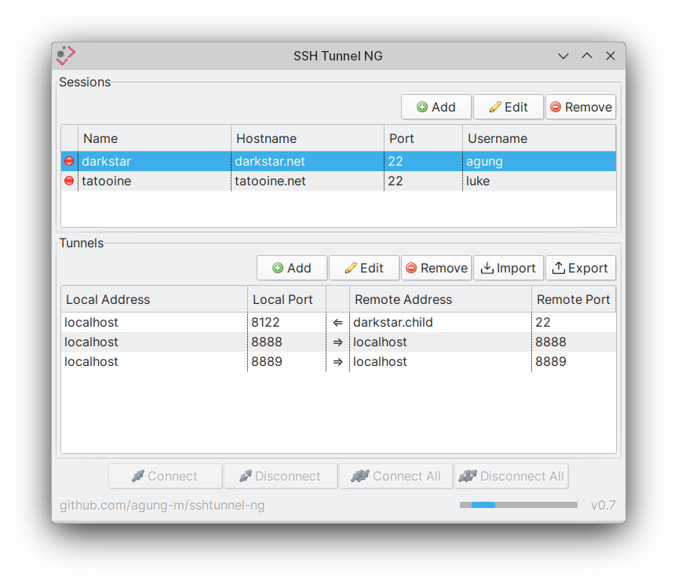

# SSH Tunnel NG

A user-friendly, fast, reliable, and cross-platform SSH tunnel manager.

What is SSH tunneling? \
https://en.wikipedia.org/wiki/Tunneling_protocol#Secure_Shell_tunneling \
https://www.ssh.com/academy/ssh/tunneling

## Features

1. Simple and clear UI
   - Quick connect/disconnect from the system tray
3. Manage multiple sessions and tunnels
   - Local and remote forwarding are supported
   - Export/import tunnel configuration to/from a CSV file
5. Support common and additional SSH options:
   - Username/password and private key authentications
   - Ciphers
   - Enable/disable compression
9. Fast and lightweight (multithreaded with a small memory footprint of ~16 MB RAM)
10. Reliable (automatic reconnection, session hang prevention)
11. Cross-platform (Linux, Windows, and macOS)
12. Portable installation, no admin/root access required (runnable from an external disk or USB drive)

## Download

### Latest version

* [Linux x86-64](https://github.com/agung-m/sshtunnel-ng/releases/download/0.7/sshtunnel-ng-0.7-dist-linux-64.zip)
* [Windows 64-bit](https://github.com/agung-m/sshtunnel-ng/releases/download/0.7/sshtunnel-ng-0.7-dist-windows-64.zip)
* [macOS x86-64](https://github.com/agung-m/sshtunnel-ng/releases/download/0.7/sshtunnel-ng-0.7-dist-mac-64.zip)
* [macOS ARM64](https://github.com/agung-m/sshtunnel-ng/releases/download/0.7/sshtunnel-ng-0.7-dist-mac-aarch64.zip)

## Requirements

[Java Runtime (JRE)](https://www.java.com/en/download/manual.jsp) 8.0 or newer

For macOS ARM64, the minimum required Java version is [JDK17](https://www.oracle.com/uk/java/technologies/downloads/#jdk17-mac).

## License

[Apache License, Version 2.0](http://www.apache.org/licenses/LICENSE-2.0)

## Contact
sshtunnel@agungmulya.com

--------------------------------------------------------------------------------
## Running

  Unzip the target distribution.

  `java -jar sshtunnel-ng-{VERSION}.jar`

## Compiling from source

  For the current platform used for compiling:

  `mvn clean assembly:single`

  For cross-platform compilation, for example:

  `mvn -P +linux,-windows clean assembly:single`

  Supported platforms: windows, windows-64, linux, linux-64, mac-64

## Changes
See [Releases](https://github.com/agung-m/sshtunnel-ng/releases).
